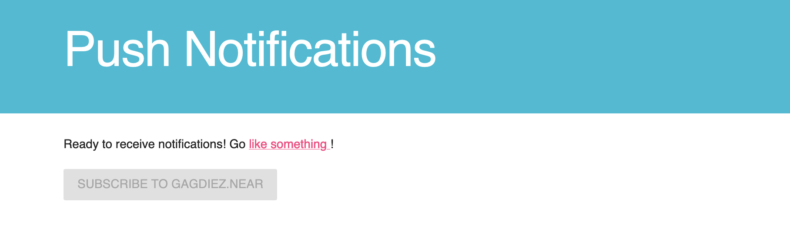

# Push Notifications

> Based on the [Code for the Web Fundamentals Tutorial](https://codelabs.developers.google.com/codelabs/push-notifications/).

This example code allows to subscribe and receive notifications from NEAR Social.
